  

  

<h3><code>samir@github ~ $ ./contributions.sh</code></h3>

  

<h3><code>samir@github ~ $ whoami</code></h3>
<table>
  <tr>
    <td valign="top"></td>
    <td valign="top"></td>
  </tr>
</table>

 

<h3><code>samir@github ~ $ systemctl status samir.target</code></h3>

  

<h3><code>samir@github ~ $ tree ~/stack</code></h3>

  

<h3><code>samir@github ~ $ ./stats.sh</code></h3>
<table>
  <tr>
    <td valign="top"></td>
    <td valign="top"></td>
  </tr>
</table>

 

<h3><code>samir@github ~ $ ls ~/projects</code></h3>

  

<h3><code>samir@github ~ $ ./connect.sh</code></h3>

 

<code>samir@github ~ $ exit 0</code>

